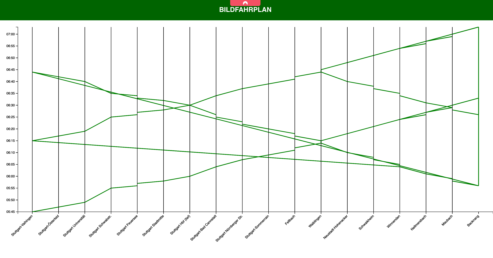

# Getting Started with Create React App

This project was bootstrapped with [Create React App](https://github.com/facebook/create-react-app).

## Available Scripts

In the project directory, you can run:

### `npm start`

Runs the app in the development mode.\
Open [http://localhost:3000](http://localhost:3000) to view it in your browser.

The page will reload when you make changes.\
You may also see any lint errors in the console.

## Assumptions

=> The train only takes one route (S3) identified by route_id=1.
=> The train only take two trips(trip_id=1 && trip_id=2)

## Implementation

The visualization uses D3.js to create interactive charts that allow the user to navigate through the train schedule data and view details.

## Notes

Initially attempted to visualize more than two trips, but found the map to be overly cluttered and difficult to interpret.
Decided to focus on visualizing two trips for clarity and ease of understanding.
